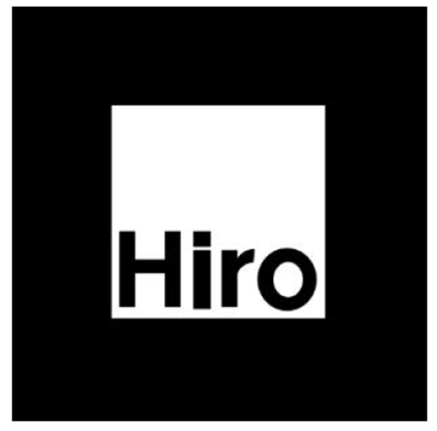

# Meu Mosquito AR

## Descrição
Esta atividade integra o **curso de imersão em realidade aumentada**, ministrado pelo iRede, e consiste em uma aplicação prática desenvolvida com os frameworks **A-Frame** e **AR.js**. O projeto utiliza um modelo 3D de mosquito `(Mosquito.glb)`, com tamanho de 58,6 KB, otimizado para execução em ambientes web. A aplicação projeta o modelo sobre um marcador do tipo **hiro** e foi configurada para funcionar em dispositivos móveis e desktops com suporte a câmera, proporcionando uma experiência acessível e multiplataforma.

### Configurações do Modelo
- **Posição**: `position="0 0 0"` (centralizado no marcador).
- **Escala**: `scale="1.5 1.5 1.5"` (proporcional ao marcador).

### Iluminação
A cena conta com:
- Luz ambiente para iluminação geral.
- Luz hemisférica para preenchimento de sombras.
- Duas luzes direcionais para destacar o modelo.

### Renderização
- **Tone Mapping**: ACESFilmic.
- **Exposição**: 1.35.
- **Correção de cores**: Ativada.

### Interações
1. **Pinch para zoom**: Ajusta a escala do modelo com dois dedos.
2. **Rotação com um dedo**: Permite rotacionar o modelo horizontal e verticalmente.
3. **Toque rápido (nova interação)**: Dispara uma animação de "pulso" que aumenta e reduz a escala do modelo.

### Requisitos
- Navegador com suporte a WebXR e permissão de câmera.
- Dispositivo móvel ou desktop com câmera.

### Como executar 🦟
1. Acesse o link da aplicação  
Abra em seu navegador: [meumosquitoar.netlify.app.]

2. Permita o uso da câmera  
Ao carregar a página, o navegador solicitará acesso à câmera. Clique em permitir para continuar.

3. Aponte para o marcador Hiro  
Com a câmera ativa, direcione-a para o marcador hiro (imagem abaixo).

### Tecnologias Utilizadas
- **A-Frame**: Framework para desenvolvimento de experiências de realidade virtual e aumentada.
- **AR.js**: Biblioteca para AR baseada em marcadores.
- **Modelo 3D**: `Mosquito.glb`.